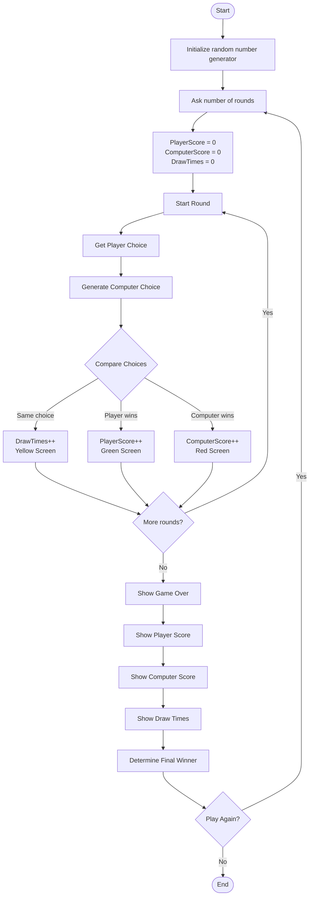

# 🪨 📄 ✂️ Stone Paper Scissors - C++

A simple **Rock Paper Scissors** console game written in C++.

The player plays against the computer for a selected number of rounds. The computer makes a random choice in every round, and the program determines the winner based on the classic Rock Paper Scissors rules.

## 🎮 Features

* Choose the number of rounds.
* Player can choose:

  * `1` → Stone 🪨
  * `2` → Paper 📄
  * `3` → Scissors ✂️
* Computer makes a random choice.
* Keeps track of:

  * Player score
  * Computer score
  * Draws
* Changes the console background color depending on the round result:

  * 🟢 Green → Player wins
  * 🔴 Red → Computer wins
  * 🟡 Yellow → Draw
* Displays the final game result.
* Asks the player whether they want to play again.

## 🧠 Game Rules

| Player      | Computer    | Winner   |
| ----------- | ----------- | -------- |
| Stone       | Scissors    | Player   |
| Paper       | Stone       | Player   |
| Scissors    | Paper       | Player   |
| Same choice | Same choice | Draw     |
| Otherwise   |             | Computer |

## 🔄 Program Algorithm



## 🧩 Main Functions

### `ReadHowManyRound()`

Gets the number of rounds from the player.

### `RandomNumber()`

Generates a random number between two given values. It is used to generate the computer's choice.

### `ReadPlayerChoice()`

Reads the player's choice and converts it to the `GameChoice` enum.

### `ComputerChoicee()`

Generates the computer's random choice.

### `ShowRoundResult()`

Compares the player's choice with the computer's choice, determines the winner, updates the scores, and changes the console color.

### `ShowGameOverScreen()`

Displays the final scores and determines the overall winner.

### `ResetScreen()`

Asks the player whether they want to play another game.

### `StartGame()`

Controls the main game loop and connects all the functions together.

## 🛠️ Technologies

* C++
* C++ Standard Library
* Console / Terminal

## ▶️ How to Run

Compile the program with a C++ compiler:

```bash
g++ main.cpp -o RockPaperScissors
```

Then run:

```bash
./RockPaperScissors
```

On Windows:

```bash
RockPaperScissors.exe
```

## 📌 Project Purpose

This project was created to practice fundamental C++ programming concepts such as:

* Functions
* Enums
* References
* Loops
* Conditional statements
* Random numbers
* User input
* Console colors
* Function declarations
* Basic game logic

## 👩‍💻 Author

Created as a C++ practice project.

**Yasmin Hammuş**
Software Engineering Student

This project was created as a C++ practice project.

